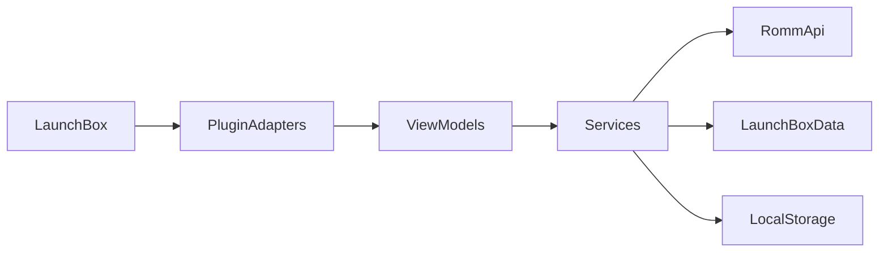

# RomM LaunchBox Plugin

LaunchBox (Windows) plugin that connects to a RomM server to import, map, and manage ROMs from within LaunchBox.

## Overview

This plugin integrates LaunchBox with a RomM server, giving users a UI for configuring server access, mapping platforms, importing ROMs, downloading media, and optionally installing content locally. It is designed for Windows LaunchBox users who want a first-class RomM workflow inside the LaunchBox UI, while remaining maintainable and extensible for developers.

For detailed technical documentation, see [Developer Guide](docs/developer-guide/DeveloperGuide.md).

## Features

- LaunchBox Tools menu entry to open the RomM configuration UI.
- Platform mapping between RomM and LaunchBox (saved mappings + auto-mapping).
- Import ROM catalogs into LaunchBox with duplicate detection.
- Optional download, extraction, and install flows.
- Install-state tracking backed by SQLite.
- MVVM-style WPF UI with async background operations.

## Screenshots

_(Add screenshots here)_

## Installation

### Build

Requirements:

- Windows
- .NET 9 SDK
- LaunchBox plugin API reference (`Unbroken.LaunchBox.Plugins.dll`)

Build the plugin:

```bash
dotnet build src/RomM.LaunchBoxPlugin/RomMbox.csproj -c Release
```

### Install into LaunchBox

1. Copy the built `RomMbox.dll` (and any referenced assemblies if needed) into:
   - `LaunchBox\Plugins\RomMbox\`
2. Launch LaunchBox. The plugin will be discovered via MEF exports.

### Required configuration

The plugin stores settings in `system/settings.json` under the plugin folder. You can configure the server through the UI (recommended). See [Configuration](#configuration) for details.

## Usage

1. In LaunchBox, open **Tools → RomM** to launch the plugin UI.
2. Configure the RomM server URL and credentials in the Connection tab.
3. Map RomM platforms to LaunchBox platforms in the Platforms tab.
4. Import games in the Games tab. Choose import, install, or merge actions.

Limitations and caveats:

- Windows-only.
- LaunchBox must be able to resolve its `DataManager` for imports.
- RomM must be reachable and authenticated.

## Configuration

Settings are stored at the path returned by [`PluginPaths.GetSettingsPath()`](src/RomM.LaunchBoxPlugin/Services/Paths/PluginPaths.cs:70). The default location is:

- `LaunchBox\Plugins\RomMbox\system\settings.json`

Example (minimal) settings file:

```json
{
  "logLevel": "Debug",
  "serverUrl": "https://romm.example.local:443",
  "hasSavedCredentials": true,
  "useSavedCredentials": true,
  "allowInvalidTls": false,
  "connectionTimeoutSeconds": 10,
  "platformMappings": [],
  "platformAliases": [],
  "excludedRommPlatformIds": [],
  "sevenZipPath": "",
  "useSevenZipFallback": true,
  "keepArchivesAfterExtraction": true,
  "promptForWindowsInstallDirectory": true,
  "defaultWindowsInstallDirectory": ""
}
```

Defaults are applied by [`PluginSettings.ApplyDefaults()`](src/RomM.LaunchBoxPlugin/Services/Settings/PluginSettings.cs:141).

## Architecture (High-Level Only)

The plugin is a monolithic .NET 9 WPF plugin using a lightweight MVVM pattern. UI view models invoke service-layer workflows that call the RomM API and LaunchBox `IDataManager`.



For detailed diagrams and flows, see [Developer Guide](docs/developer-guide/DeveloperGuide.md).

## Development

Build requirements:

- .NET 9 SDK
- Windows
- LaunchBox plugin API reference

Solution structure:

- Plugin code: `src/RomM.LaunchBoxPlugin/`
- Tests: `src/RomM.LaunchBoxPlugin.Tests/`

Running locally:

1. Build the plugin.
2. Copy the output DLL to `LaunchBox\Plugins\RomMbox\`.
3. Start LaunchBox and open Tools → RomM.

Debugging:

- Use LaunchBox as the host process and rely on the log output in `system/RomM.Plugin.log`.

## Extension Notes

Extension points are primarily in the service and UI layers:

- New service workflows can be added under `Services/`.
- New UI pages can be added under `UI/Views` + `UI/ViewModels`.

Avoid modifying core plugin adapters unless you are changing LaunchBox integration behavior. See [Developer Guide](docs/developer-guide/DeveloperGuide.md) for details.

## Troubleshooting

**Plugin not detected**

- Ensure `RomMbox.dll` is under `LaunchBox\Plugins\RomMbox\`.
- Verify LaunchBox is running on Windows and can load the plugin assembly.

**Build errors**

- Ensure `Unbroken.LaunchBox.Plugins.dll` is referenced and available.

**LaunchBox integration problems**

- Check `system/RomM.Plugin.log` for errors (see [`PluginPaths.GetLogPath()`](src/RomM.LaunchBoxPlugin/Services/Paths/PluginPaths.cs:80)).

## Contributing

- Keep changes scoped to a single feature or fix.
- Follow existing naming and folder conventions.
- Add or update unit tests under `src/RomM.LaunchBoxPlugin.Tests/` when modifying core workflows.
