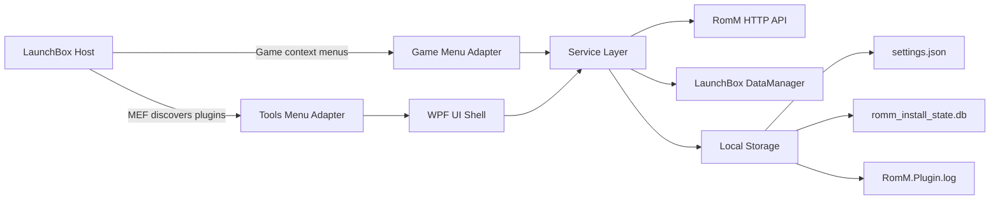

# Architecture Overview

This document describes the overall architecture of the RomM LaunchBox plugin, focusing on how the WPF UI, plugin adapters, and service layer collaborate to integrate RomM with LaunchBox.

## Table of Contents

- [High-Level Component Model](#high-level-component-model)
- [Core Modules](#core-modules)
- [Key Design Decisions](#key-design-decisions)
- [Primary Data Stores](#primary-data-stores)
- [Happy Path vs. Failure Paths](#happy-path-vs-failure-paths)

## High-Level Component Model

**Key entry points**

- Bootstrap: [`RomMbox.Plugin.PluginEntry`](src/RomM.LaunchBoxPlugin/Plugin/PluginEntry.cs:12)
- Tools menu adapter: [`RomMbox.Plugin.Adapters.ToolsMenu.RomMToolsMenuItem`](src/RomM.LaunchBoxPlugin/Plugin/Adapters/ToolsMenu/RomMToolsMenuItem.cs:12)
- Game menu adapter: [`RomMbox.Plugin.Adapters.GameMenu.RommMultiMenuItem`](src/RomM.LaunchBoxPlugin/Plugin/Adapters/GameMenu/RommMultiMenuItem.cs:21)
- UI shell: [`RomMbox.UI.MainWindow`](src/RomM.LaunchBoxPlugin/UI/MainWindow.xaml:1) + [`RomMbox.UI.ViewModels.MainWindowViewModel`](src/RomM.LaunchBoxPlugin/UI/ViewModels/MainWindowViewModel.cs:8)

## Core Modules

### 1) Plugin Adapters (LaunchBox integration)

The plugin exposes MEF-exported adapters that LaunchBox discovers at runtime. These adapters are responsible for:

- Surfacing menu entries (Tools menu and game context menu).
- Bootstrapping shared services via [`PluginEntry`](src/RomM.LaunchBoxPlugin/Plugin/PluginEntry.cs:12).
- Launching the WPF UI shell (Tools menu) or invoking install/uninstall/play flows (game menu).

Primary classes:

- [`RomMToolsMenuItem`](src/RomM.LaunchBoxPlugin/Plugin/Adapters/ToolsMenu/RomMToolsMenuItem.cs:12)
- [`RommMultiMenuItem`](src/RomM.LaunchBoxPlugin/Plugin/Adapters/GameMenu/RommMultiMenuItem.cs:21)

### 2) UI Layer (WPF + MVVM)

The UI is a WPF shell with navigation and multiple pages (Connection, Platforms, Games, Test). The UI layer follows an MVVM-like pattern:

- Views: XAML files in `UI/Views` and `UI/MainWindow.xaml`
- ViewModels: `UI/ViewModels/*`
- Infrastructure: [`ObservableObject`](src/RomM.LaunchBoxPlugin/UI/Infrastructure/ObservableObject.cs:7), [`RelayCommand`](src/RomM.LaunchBoxPlugin/UI/Infrastructure/RelayCommand.cs:8)

The shell view model coordinates navigation and cross-page state like connection status and footer commands.

Primary classes:

- [`MainWindowViewModel`](src/RomM.LaunchBoxPlugin/UI/ViewModels/MainWindowViewModel.cs:8)
- [`ConnectionViewModel`](src/RomM.LaunchBoxPlugin/UI/ViewModels/ConnectionViewModel.cs:14)
- [`PlatformsViewModel`](src/RomM.LaunchBoxPlugin/UI/ViewModels/PlatformsViewModel.cs:14)
- [`ImportViewModel`](src/RomM.LaunchBoxPlugin/UI/ViewModels/ImportViewModel.cs:20)

### 3) Service Layer (business logic)

The service layer owns the core workflows for RomM integration, including API calls, imports, downloads, install/uninstall, and settings.

Key services:

- RomM API wrapper: [`RommClient`](src/RomM.LaunchBoxPlugin/Services/RommClient.cs:18)
- Import orchestration: [`ImportService`](src/RomM.LaunchBoxPlugin/Services/ImportService.cs:26)
- Download + extraction: [`DownloadService`](src/RomM.LaunchBoxPlugin/Services/DownloadService.cs:14) + [`ArchiveService`](src/RomM.LaunchBoxPlugin/Services/ArchiveService.cs:18)
- Platform mapping: [`PlatformMappingService`](src/RomM.LaunchBoxPlugin/Services/PlatformMappingService.cs:20)
- Install tracking: [`InstallStateService`](src/RomM.LaunchBoxPlugin/Services/InstallStateService.cs:16)
- Authentication checks: [`AuthService`](src/RomM.LaunchBoxPlugin/Services/Auth/AuthService.cs:12)
- External URL launch: [`ExternalLauncherService`](src/RomM.LaunchBoxPlugin/Services/ExternalLauncherService.cs:7)

### 4) Storage

The plugin uses small local stores instead of a full database:

- Settings JSON: resolved via [`PluginPaths.GetSettingsPath()`](src/RomM.LaunchBoxPlugin/Services/Paths/PluginPaths.cs:70)
- Credentials: [`CredentialStore`](src/RomM.LaunchBoxPlugin/Storage/CredentialStore.cs:1)
- Install state SQLite: [`InstallStateService`](src/RomM.LaunchBoxPlugin/Services/InstallStateService.cs:16)
- Logs: [`FileLogSink`](src/RomM.LaunchBoxPlugin/Services/Logging/FileLogSink.cs:1)

## Key Design Decisions

### Monolithic plugin, explicit wiring

There is no dependency injection container. Instead, [`PluginEntry`](src/RomM.LaunchBoxPlugin/Plugin/PluginEntry.cs:12) manually wires the core services. This keeps LaunchBox integration straightforward and avoids requiring a DI framework in the plugin host.

### MVVM-style UI for maintainability

WPF views are kept thin while the view models own state transitions, commands, and background orchestration. Shared behaviors are centralized in [`ObservableObject`](src/RomM.LaunchBoxPlugin/UI/Infrastructure/ObservableObject.cs:7) and [`RelayCommand`](src/RomM.LaunchBoxPlugin/UI/Infrastructure/RelayCommand.cs:8).

### File-based settings and SQLite state

User configuration is stored in JSON via [`SettingsManager`](src/RomM.LaunchBoxPlugin/Services/Settings/SettingsManager.cs:14), while install state needs relational lookups, so a small SQLite DB is used via [`InstallStateService`](src/RomM.LaunchBoxPlugin/Services/InstallStateService.cs:16).

### API client with explicit error typing

RomM HTTP errors are normalized into [`RommApiException`](src/RomM.LaunchBoxPlugin/Services/RommApiException.cs:19), enabling UI flows to distinguish auth failures, missing content, and server errors.

## Primary Data Stores

| Store | Purpose | API |
| --- | --- | --- |
| settings.json | Server URL, mappings, preferences | [`SettingsManager`](src/RomM.LaunchBoxPlugin/Services/Settings/SettingsManager.cs:14) |
| romm_install_state.db | Install/rom state per LaunchBox game | [`InstallStateService`](src/RomM.LaunchBoxPlugin/Services/InstallStateService.cs:16) |
| RomM.Plugin.log | Operational + diagnostic logs | [`LoggingService`](src/RomM.LaunchBoxPlugin/Services/Logging/LoggingService.cs:5) |

## Happy Path vs. Failure Paths

**Happy path (import + install)**

1. User configures connection in [`ConnectionViewModel`](src/RomM.LaunchBoxPlugin/UI/ViewModels/ConnectionViewModel.cs:17).
2. Platform mappings are resolved via [`PlatformMappingService`](src/RomM.LaunchBoxPlugin/Services/PlatformMappingService.cs:20).
3. User imports ROMs; [`ImportService`](src/RomM.LaunchBoxPlugin/Services/ImportService.cs:26) creates or updates LaunchBox games.
4. If installing, [`DownloadService`](src/RomM.LaunchBoxPlugin/Services/DownloadService.cs:14) and [`WindowsInstallSubsystem`](src/RomM.LaunchBoxPlugin/Services/Install/WindowsInstallSubsystem.cs:26) download and install content.
5. Install state is persisted in [`InstallStateService`](src/RomM.LaunchBoxPlugin/Services/InstallStateService.cs:16).

**Common failure paths**

- Missing server URL or credentials → [`RommClient`](src/RomM.LaunchBoxPlugin/Services/RommClient.cs:18) throws [`RommApiException`](src/RomM.LaunchBoxPlugin/Services/RommApiException.cs:19) with `AuthExpired`.
- LaunchBox `IDataManager` unavailable → [`ImportService`](src/RomM.LaunchBoxPlugin/Services/ImportService.cs:26) throws `InvalidOperationException`.
- Download failures → [`DownloadService`](src/RomM.LaunchBoxPlugin/Services/DownloadService.cs:14) returns a failed [`DownloadResult`](src/RomM.LaunchBoxPlugin/Models/Download/DownloadResult.cs:1) with error text.
- Extraction failure → [`ArchiveService`](src/RomM.LaunchBoxPlugin/Services/ArchiveService.cs:18) logs and may throw if no fallback exists.

Next: see [Plugin Lifecycle](PluginLifecycle.md) for the runtime sequence of events.
