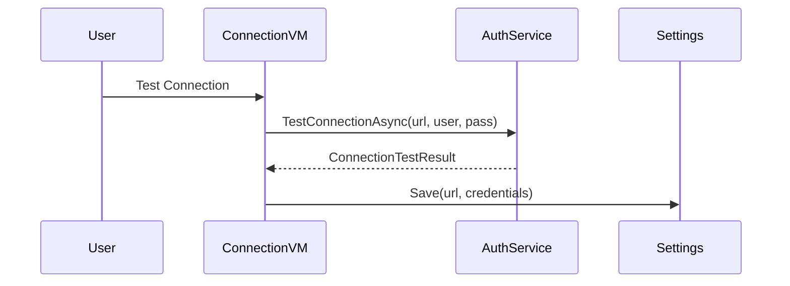
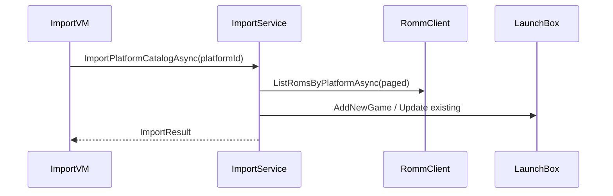

# Data Flow

This document describes the key workflows in the plugin: connection setup, platform mapping, importing ROMs, downloading media, and installing games. Each section includes happy-path and failure-path behavior.

## Table of Contents

- [Connection Setup](#connection-setup)
- [Platform Mapping](#platform-mapping)
- [Catalog Import](#catalog-import)
- [Selective Import + Install](#selective-import--install)
- [Media Download](#media-download)
- [Save File Import](#save-file-import)

## Connection Setup

**Primary classes**

- [`ConnectionViewModel`](src/RomM.LaunchBoxPlugin/UI/ViewModels/ConnectionViewModel.cs:17)
- [`AuthService`](src/RomM.LaunchBoxPlugin/Services/Auth/AuthService.cs:12)
- [`SettingsManager`](src/RomM.LaunchBoxPlugin/Services/Settings/SettingsManager.cs:14)

**Happy path**

1. User enters server + credentials.
2. Connection test succeeds (`HTTP 200` on `/api/login`).
3. Settings and credentials are saved, UI status flips to Connected.

**Failure paths**

- Invalid URL or timeout → [`AuthService`](src/RomM.LaunchBoxPlugin/Services/Auth/AuthService.cs:12) returns failed status, UI shows error.
- Save failure → [`SettingsManager`](src/RomM.LaunchBoxPlugin/Services/Settings/SettingsManager.cs:14) logs error and UI shows failure dialog.

## Platform Mapping

**Primary classes**

- [`PlatformMappingService`](src/RomM.LaunchBoxPlugin/Services/PlatformMappingService.cs:20)
- [`PlatformsViewModel`](src/RomM.LaunchBoxPlugin/UI/ViewModels/PlatformsViewModel.cs:14)

Flow:

1. View model calls `DiscoverPlatformsAsync()` to fetch RomM platforms.
2. Mapping service resolves LaunchBox platform names using:
   - Saved mappings
   - Default mapping file (`default-mapping.yaml`)
   - Predefined aliases
   - Fuzzy match against LaunchBox platform names
3. User edits mappings and saves.

**Failure paths**

- Missing/invalid server URL → `DiscoverPlatformsAsync` throws, UI shows “Server not configured.”
- LaunchBox platform XML missing → mapping save logs warnings but does not fail UI.

## Catalog Import

**Primary classes**

- [`ImportService`](src/RomM.LaunchBoxPlugin/Services/ImportService.cs:26)
- [`RommClient`](src/RomM.LaunchBoxPlugin/Services/RommClient.cs:18)
- LaunchBox `IDataManager`

**Happy path**

- The service pages through RomM ROMs, builds a match index, and creates or soft-syncs LaunchBox games.
- Progress is reported back to the UI.

**Failure paths**

- `IDataManager` unavailable → throws `InvalidOperationException`.
- API errors → [`RommApiException`](src/RomM.LaunchBoxPlugin/Services/RommApiException.cs:19) logged, import continues per-ROM where possible.

## Selective Import + Install

**Primary classes**

- [`ImportViewModel`](src/RomM.LaunchBoxPlugin/UI/ViewModels/ImportViewModel.cs:20)
- [`ImportService`](src/RomM.LaunchBoxPlugin/Services/ImportService.cs:26)
- [`DownloadService`](src/RomM.LaunchBoxPlugin/Services/DownloadService.cs:14)
- [`WindowsInstallSubsystem`](src/RomM.LaunchBoxPlugin/Services/Install/WindowsInstallSubsystem.cs:26)

Flow:

1. User selects ROMs in UI, chooses Import/Install/Merge.
2. `ImportService.ImportSelectedRomsAsync` orchestrates the workflow.
3. If install is requested, `DownloadService` downloads content and `WindowsInstallSubsystem` installs it.
4. Install state is persisted in [`InstallStateService`](src/RomM.LaunchBoxPlugin/Services/InstallStateService.cs:16).

**Failure paths**

- Download failure → download result returns `Success=false`, import item fails.
- Install errors → Windows install subsystem logs and surfaces error message; app keeps running.

## Media Download

**Primary classes**

- [`ImportService.DownloadMediaAsync`](src/RomM.LaunchBoxPlugin/Services/ImportService.cs:2186)
- [`RommClient.DownloadMediaAsync`](src/RomM.LaunchBoxPlugin/Services/RommClient.cs:231)

Media (cover art, screenshots) is downloaded per ROM and written directly to LaunchBox image folders; `IGame` image paths are read-only, so file placement is used instead.

**Failure paths**

- Media download fails → logs warning and continues without blocking the import.

## Save File Import

**Primary classes**

- [`ImportService.ImportSavesAsync`](src/RomM.LaunchBoxPlugin/Services/ImportService.cs:2385)
- [`RommClient.ListSavesAsync`](src/RomM.LaunchBoxPlugin/Services/RommClient.cs:251)

Saves are pulled from RomM, written to LaunchBox save directories, and tracked in the import report.

**Failure paths**

- Missing or inaccessible save download → increments failed count, logs error, and continues.

Next: see [Concurrency Model](ConcurrencyModel.md).
