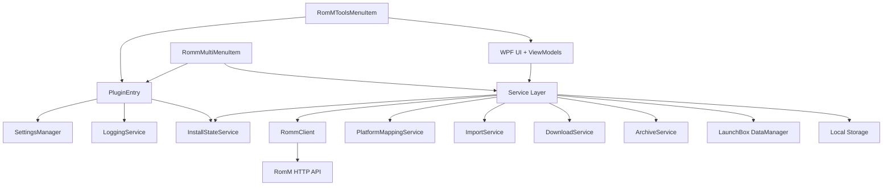

# Dependency Graph

This document explains the major dependencies between modules and provides a visual dependency map of the plugin runtime.

## Table of Contents

- [High-Level Dependency Graph](#high-level-dependency-graph)
- [Service Wiring](#service-wiring)
- [UI-to-Service Dependencies](#ui-to-service-dependencies)
- [Data Stores and External Dependencies](#data-stores-and-external-dependencies)

## High-Level Dependency Graph

## Service Wiring

The core wiring happens in [`PluginEntry`](src/RomM.LaunchBoxPlugin/Plugin/PluginEntry.cs:12). It constructs:

- [`SettingsManager`](src/RomM.LaunchBoxPlugin/Services/Settings/SettingsManager.cs:14)
- [`LoggingService`](src/RomM.LaunchBoxPlugin/Services/Logging/LoggingService.cs:5)
- [`InstallStateService`](src/RomM.LaunchBoxPlugin/Services/InstallStateService.cs:16)

Other services are created on-demand in UI or menu adapters, for example:

- [`ImportService`](src/RomM.LaunchBoxPlugin/Services/ImportService.cs:26)
- [`RommClient`](src/RomM.LaunchBoxPlugin/Services/RommClient.cs:18)
- [`PlatformMappingService`](src/RomM.LaunchBoxPlugin/Services/PlatformMappingService.cs:20)

There is no dependency injection container; services are explicitly instantiated where needed.

## UI-to-Service Dependencies

- [`ConnectionViewModel`](src/RomM.LaunchBoxPlugin/UI/ViewModels/ConnectionViewModel.cs:17) uses [`AuthService`](src/RomM.LaunchBoxPlugin/Services/Auth/AuthService.cs:12) and [`SettingsManager`](src/RomM.LaunchBoxPlugin/Services/Settings/SettingsManager.cs:14).
- [`PlatformsViewModel`](src/RomM.LaunchBoxPlugin/UI/ViewModels/PlatformsViewModel.cs:14) depends on [`PlatformMappingService`](src/RomM.LaunchBoxPlugin/Services/PlatformMappingService.cs:20).
- [`ImportViewModel`](src/RomM.LaunchBoxPlugin/UI/ViewModels/ImportViewModel.cs:20) depends on [`ImportService`](src/RomM.LaunchBoxPlugin/Services/ImportService.cs:26), which itself depends on [`RommClient`](src/RomM.LaunchBoxPlugin/Services/RommClient.cs:18).

## Data Stores and External Dependencies

| Dependency | Used By | Purpose |
| --- | --- | --- |
| RomM HTTP API | [`RommClient`](src/RomM.LaunchBoxPlugin/Services/RommClient.cs:18) | Platform, ROM, media, save data |
| LaunchBox DataManager | [`ImportService`](src/RomM.LaunchBoxPlugin/Services/ImportService.cs:26) | Create/update game metadata |
| settings.json | [`SettingsManager`](src/RomM.LaunchBoxPlugin/Services/Settings/SettingsManager.cs:14) | Configuration + mappings |
| romm_install_state.db | [`InstallStateService`](src/RomM.LaunchBoxPlugin/Services/InstallStateService.cs:16) | Install tracking |
| RomM.Plugin.log | [`LoggingService`](src/RomM.LaunchBoxPlugin/Services/Logging/LoggingService.cs:5) | Diagnostics |

Next: see [Data Flow](DataFlow.md).
