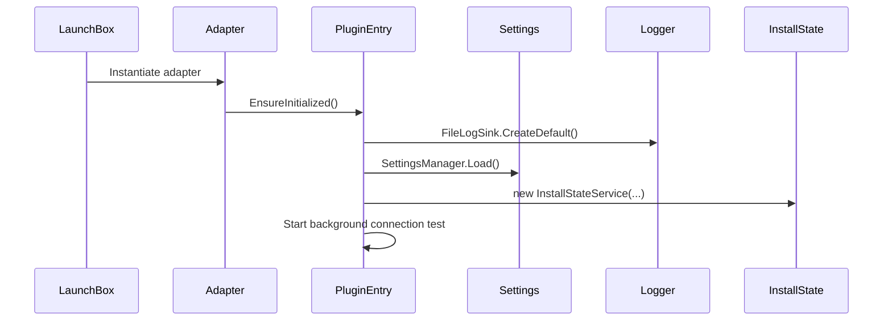
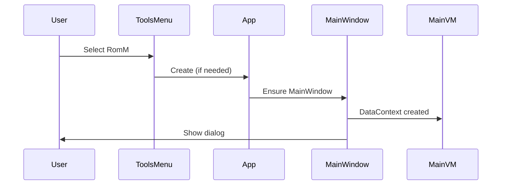

# Plugin Lifecycle

This document explains how the RomM LaunchBox plugin is discovered, initialized, and shut down inside the LaunchBox host. It highlights the entry points, background initialization, and the UI lifecycle.

## Table of Contents

- [Discovery and Entry Points](#discovery-and-entry-points)
- [Initialization Sequence](#initialization-sequence)
- [WPF UI Lifecycle](#wpf-ui-lifecycle)
- [Background Connection Test](#background-connection-test)
- [Shutdown and Cleanup](#shutdown-and-cleanup)
- [Happy Path vs. Failure Paths](#happy-path-vs-failure-paths)

## Discovery and Entry Points

LaunchBox uses MEF (Managed Extensibility Framework) to discover plugins that export its interfaces. This plugin exposes:

- Tools menu item: [`RomMToolsMenuItem`](src/RomM.LaunchBoxPlugin/Plugin/Adapters/ToolsMenu/RomMToolsMenuItem.cs:12) (`ISystemMenuItemPlugin`)
- Game context menu item: [`RommMultiMenuItem`](src/RomM.LaunchBoxPlugin/Plugin/Adapters/GameMenu/RommMultiMenuItem.cs:21) (`IGameMultiMenuItemPlugin`)

These adapters are the first code executed by LaunchBox when a user triggers the menu entries.

## Initialization Sequence

The shared bootstrap entry is [`PluginEntry.Initialize()`](src/RomM.LaunchBoxPlugin/Plugin/PluginEntry.cs:35). It is safe to call multiple times and is guarded by a lock.

Sequence highlights:

1. Create the log sink and logger.
2. Load settings via [`SettingsManager`](src/RomM.LaunchBoxPlugin/Services/Settings/SettingsManager.cs:14).
3. Construct and cache shared services:
   - [`InstallStateService`](src/RomM.LaunchBoxPlugin/Services/InstallStateService.cs:16)
4. Ensure stub application paths via [`StubApplicationPathService`](src/RomM.LaunchBoxPlugin/Services/StubApplicationPathService.cs:1).
5. Trigger background connection testing (non-blocking).

## WPF UI Lifecycle

The Tools menu entry launches the WPF UI shell:

- If an existing `Application.Current` exists, it reuses the dispatcher.
- Otherwise, it spins up a dedicated STA thread and creates a new [`App`](src/RomM.LaunchBoxPlugin/UI/App.xaml.cs:5).

Window initialization flow:

1. [`App.InitializeForPluginHost()`](src/RomM.LaunchBoxPlugin/UI/App.xaml.cs:18) configures shutdown mode and ensures `MainWindow`.
2. [`MainWindow`](src/RomM.LaunchBoxPlugin/UI/MainWindow.xaml:1) is created and applies custom chrome styling.
3. [`MainWindowViewModel`](src/RomM.LaunchBoxPlugin/UI/ViewModels/MainWindowViewModel.cs:8) initializes child view models.

## Background Connection Test

During initialization, [`PluginEntry`](src/RomM.LaunchBoxPlugin/Plugin/PluginEntry.cs:12) tries to validate saved credentials if they exist:

- Only runs if `UseSavedCredentials` and `HasSavedCredentials` are true.
- Executes on a background task to avoid UI delay.
- Emits `BackgroundConnectionCompleted` when finished.

The UI listens for this event in [`ConnectionViewModel`](src/RomM.LaunchBoxPlugin/UI/ViewModels/ConnectionViewModel.cs:17) and updates status indicators.

## Shutdown and Cleanup

When the WPF window closes, [`MainWindow`](src/RomM.LaunchBoxPlugin/UI/MainWindow.xaml.cs:10) attempts to refresh LaunchBox’s `IDataManager`:

- `BackgroundReloadSave`
- `ReloadIfNeeded`
- `ForceReload`

Exceptions are swallowed to avoid crashing the plugin host.

## Happy Path vs. Failure Paths

**Happy path**

1. LaunchBox instantiates adapter.
2. Plugin initializes shared services successfully.
3. UI opens; connection status is validated.
4. User performs mapping/import/installation.
5. Closing the window triggers LaunchBox data refresh.

**Failure paths**

- Logging or settings failures → logged and rethrown inside [`PluginEntry.Initialize()`](src/RomM.LaunchBoxPlugin/Plugin/PluginEntry.cs:35).
- Missing/invalid credentials → background test returns `ConnectionFailed`, UI shows “Not Connected”.
- LaunchBox DataManager refresh fails on shutdown → silently swallowed to avoid host crash.

Next: see [Project Structure](ProjectStructure.md) for the repository and namespace layout.
