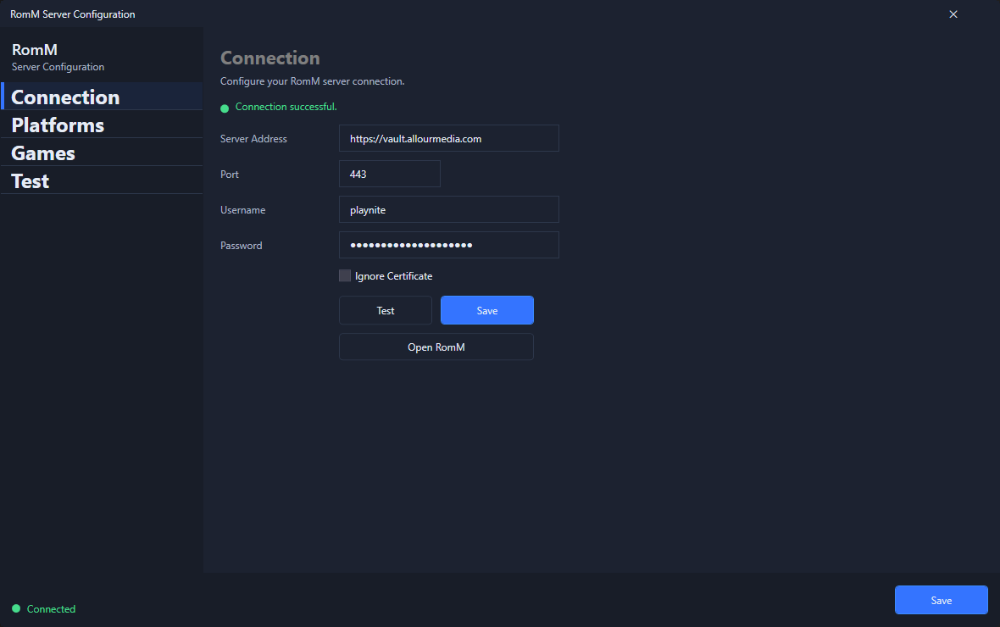

# Configuration

Use this to configure the RomMbox plugin for use with your LaunchBox system.

## Pre-Requisites

- LaunchBox 13.26 or higher, installed and set up
- RomMbox plugin installed
- Your platforms/emulators set up/defined in LaunchBox (*recommended, but not required*) 

## Steps

Follow these steps to configure the plugin for general usage.  There will be a few high level steps:

1. [Logging into RomM](#logging-in)
2. [Platform Mapping](#platform-mapping)
3. [Importing Games](#import-games)

### Logging Into RomM 

Use this to authenticate with your RomM server in order to pull the games from your server.

1. Launch the RomM Plugin Screen by going to *Tools > RomM*.
2. Enter the Address of your RomM server in the **Server Address** field.  This is what you enter into a web browser to access your RomM environment.
    - If you have it behind a reverse proxy, it is likely something like `https://romm.awesome-domain.cool`
    - If you access it only on a LAN (not publicly accessible), it is likely an IP address like `http://192.168.1.11`.
3. Enter the port you use to connect to the server, if you connect securely (default, protected by an SSL certificate) - it will likely be `443`, when in doubt - just look at the address you navigate to in a web browser.
4. Enter the username you would log into RomM with into the *Username* field.
5. Enter the password you would log into RomM with into the *Password* field.

    > *Ignore Certificate*: Check this box if you have protected your RomM server with an untrusted/self-signed certificate.  Most people will not need this option selected.

6. Select **Test** to test the configured values and ensure a connection to the server was successful.  Upon successful connection, the status will update and the **Save** button will become selectable.
 
    

7. The other tabs on the left-hand side are now unlocked and selectable.

> Connection details and credentials are securely saved using the Windows DPAPI system.

### Platform Mapping 

This will cover the platform tab and the general mapping - not the individual platform's configuration itself, those will be relegated to other guides.

1. Click the **Platforms** tab of the RomM plugin screen.

> The screen will now display a list of all the platforms that are configured in the RomM server, along with the suspected LaunchBox counterparts.

2. 

### Importing Games 