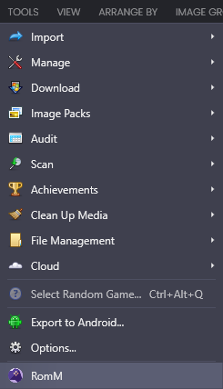
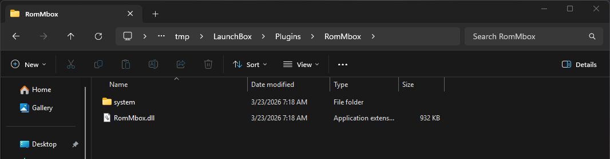

# Installation

Use this guide to install the *RomMbox* plugin into your LaunchBox installation.

## Pre-Requisites
- LaunchBox 13.26 or Higher, installes and set up
- Ability to download/extract packages from GitHub

  

## Steps

1. Download the latest release from the official [GitHub Releases](https://github.com/Evilperson1337/rommbox/releases/latest).
2. Open the File Explorer to your LaunchBox installation.
3. Open the Plugins folder in the LaunchBox installation. *e.g. `C:\LaunchBox\Plugins`*
4. Extract the contents of the downloaded release into the Plugins folder. *e.g. `C:\LaunchBox\Plugins\RomMbox`*

    

## Final Notes

The plugin has now been installed, proceed to the configuration guide.