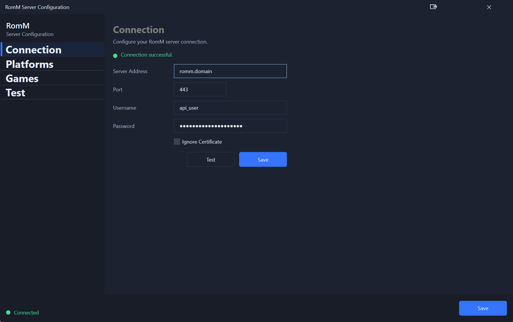
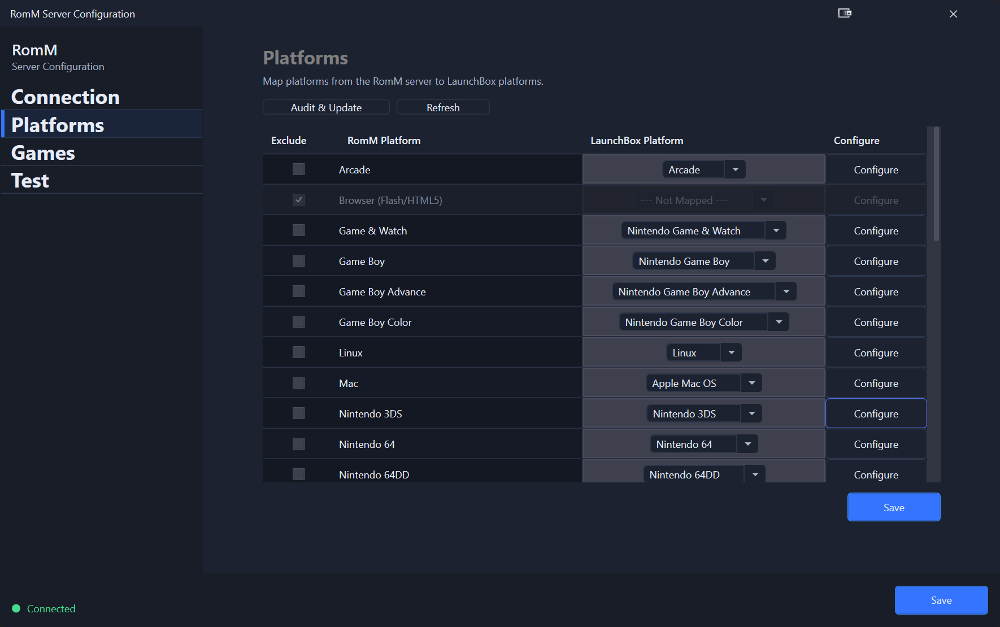
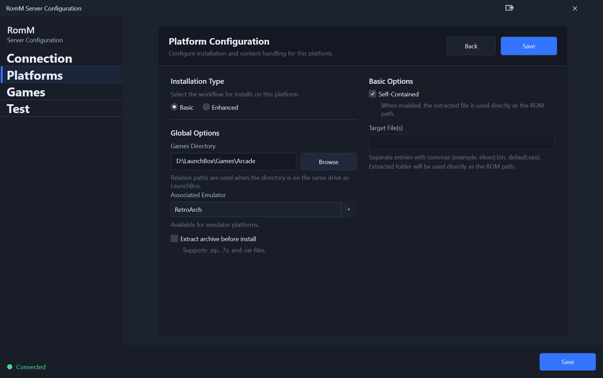

# Configuration

Use the RomM window in LaunchBox to configure your connection, platform mappings, and download behavior.

## Connection settings

Open **Tools → RomM → Connection**.

### Fields

- **Server Address**: The hostname or IP of your RomM server.
- **Port**: Usually `443` for HTTPS.
- **Username** / **Password**: Your RomM credentials.  OIDC/OAuth is on the roadmap, but basic auth only for now.
- **Ignore Certificate**: Enable only if your server uses a self‑signed certificate.

### Save your connection

1. Enter your server details.
2. Select **Test**.
3. If the status shows **Connected**, select **Save**.  The other tabs should now be unlocked.

  

## Platform Configuration

Open **Tools → RomM → Platforms**.

This page maps RomM platforms to LaunchBox platforms. You must map or exclude every RomM platform before saving.

### Map platforms

1. Select a **LaunchBox Platform** for each **RomM Platform**.
2. (Optional) Use **Exclude** to skip a platform.
3. Select **Save**.

  

### Configure platform install options

Select **Configure** on a platform row to open **Platform Install Options**.

Options include:

- **Install Scenario**
  - **Basic**: Use the downloaded file as-is.
  - **Enhanced**: Look for a specific file after extraction (Target Import File).
  - **Installer**: Run a silent installer to produce the final install.
- **Disable auto‑import**: Keeps manual import available but disables automatic import for this platform.  NOT FULLY IMPLEMENTED YET.
- **Extract archive after download** and **Extraction Behavior**.
- **Game Directory**: Override where content is installed.
- **Installer Mode** (Windows platforms only).
- Optional content for Windows platforms:
  - **Install OST content**
  - **Install bonus content**
  - **Install pre‑reqs content**

  

## Where settings are stored

Settings are saved to:

- `LaunchBox\Plugins\RomM\system\settings.json`

> **Warning:** Editing this file manually is not recommended unless you know what you are doing.
