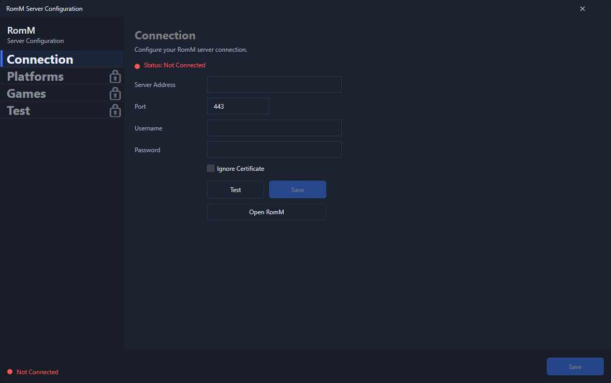

# Connection Tab
Use this tab to configure your connection to the RomM Server.

1. Open **Tools → RomM → Connection**.
2. Fill in the fields using the section below if you need it.
3. Hit **Test** to confirm your connection to the server.
4. Hit **Save** to save the connection (uses Windows Credential Management for secure storage).

Upon successful save, the other tabs should unlock and the status should show *Connected*

## Fields Explained

- **Server URL**: The full base address for your RomM server, including `http://` or `https://`.
- **Authentication Mode**: The plugin supports both basic credentials and OIDC token-based authentication (NOT FUNCTIONING YET).
- **Username** / **Password**: Used when the authentication mode is basic credentials.
- **Access Token** / **Refresh Token**: Used when the authentication mode is OIDC.
- **Start Sign-In**: Opens the RomM OIDC sign-in flow in your browser when OIDC is selected. (NOT FUNCTIONING YET)
- **Ignore Certificate**: Enable only if your server uses a self‑signed certificate.

## Notes

- Saved credentials and saved OIDC token state are stored through Windows Credential Manager.
- When saved credentials are enabled, the plugin can run a background connection test so the UI can show connection status after startup.
