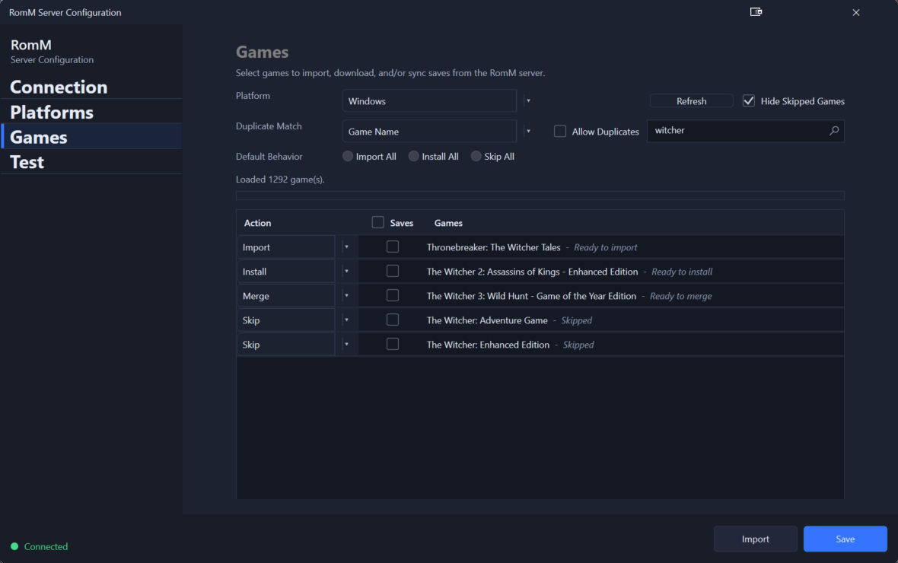
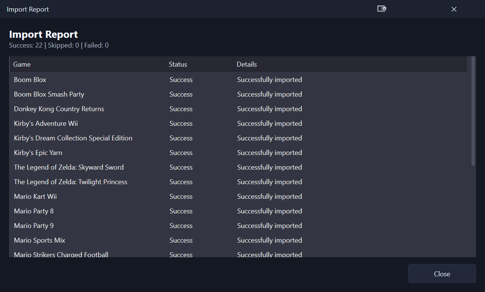

# Importing games

The **Games** page lets you import ROMs from your RomM server into LaunchBox. You can import metadata, download media, and optionally download ROMs or save files.

## Open the import screen

1. Open **Tools → RomM**.
2. Go to the **Games** page.

    

## Load games from a platform

1. Choose a **Platform** from the dropdown.
2. The list loads games from that RomM platform.

If nothing loads, return to **Connection** and **Platforms** to confirm your server is configured and platforms are mapped.

## Choose import behavior

### Default behavior (bulk)

At the top of the page you can select a default action for all rows:

- **Import All**
- **Install All**
- **Skip All**

### Per‑game actions

Each row has an **Action** column with these options:

- **Import**: Add the game to LaunchBox and sync metadata.
- **Install**: Import + download the game (and optionally extract/install it).
- **Merge**: Update an existing LaunchBox game if it is a match.
- **Skip**: Do not import this game.

## Control duplicate matching

Use **Duplicate Match** to decide how the plugin detects existing games:

- **Game Name**: Does the match based on the name of the game.
- **File Name**: Does the match based on the file name of the game.
- **MD5**: Does the match based on the MD5 Hash.  Takes the longest, NOT FULLY IMPLEMENTED.

Use **Allow Duplicates** if you want to import a game even when a match is found.

## Filter and review

- **Search** filters the grid by name.
- **Hide Skipped Games** removes skipped rows from the list.

## Save files and media

Each row includes:

- **Saves** checkbox: download save data for the game.

> **Note:** Save downloads use the RomM server save data. Saves are stored under LaunchBox’s `Saves` folder.  This feature is currently in Early Access in LaunchBox, so functionality may not work as changes occur.  BACKUP YOUR EXISTING SAVES BEFORE USING THIS.

## Run the import

1. Choose your actions for the rows.
2. Select **Import** (bottom of the window).
3. Watch the progress bar and status text.
4. When finished, an **Import Report** window shows successes, skips, and failures.

    

## Expected results

- Imported games appear in LaunchBox.
- Installed games have local content downloaded and configured.
- Save files (if selected) are written under `LaunchBox\Saves\<Platform>`.

## Common issues

### “Server not configured”

Go to the **Connection** page, test and save the connection, then return to **Games**.

### Duplicate results are unexpected

- Change the **Duplicate Match** mode.
- Disable **Allow Duplicates** if you only want one entry per game.

### Import fails

Check **RomM.Plugin.log** and see [Troubleshooting](./troubleshooting.md).
