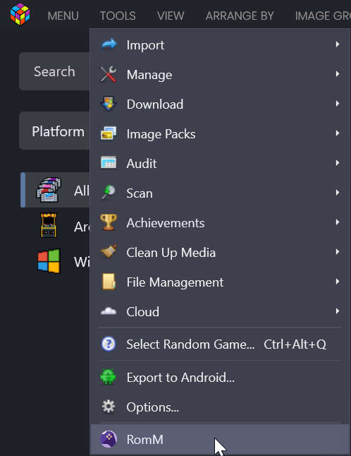

# Installation

This plugin is installed by copying its files into your LaunchBox plugins folder.

## Prerequisites

- Windows
- LaunchBox installed
- The RomM LaunchBox plugin files

## Install the plugin

1. Close LaunchBox if it is running.
2. Copy the plugin output **including** `RomMbox.dll` **and** `RomMbox.deps.json` into:
   - `LaunchBox\Plugins\RomMbox\`
3. Copy the `system\` folder (settings + assets) into the same plugin folder.
4. Start LaunchBox.
5. Verify the plugin is available under **Tools → RomM**.

   

## Upgrade the plugin

1. Close LaunchBox.
2. Replace the existing files in `LaunchBox\Plugins\RomMbox\` with the new version.
3. Start LaunchBox and verify **Tools → RomM** opens correctly.

> **Tip:** Keep a backup of your `LaunchBox\Plugins\RomM\system\settings.json` file before upgrading.

## Uninstall the plugin

1. Close LaunchBox.
2. Delete the folder:
   - `LaunchBox\Plugins\RomMbox\`
3. Start LaunchBox.

> **Warning:** This removes your RomM plugin settings and logs. It does not remove games already imported into LaunchBox.
