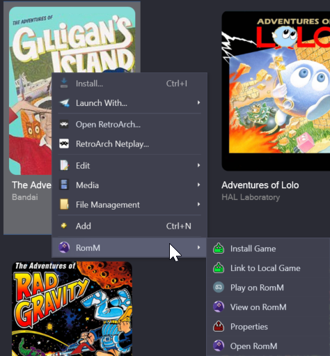

# Per Game Menu Options
This helps you control actions on a per-game basis in the library view, rather than generally through the **Tools → RomM** menu.

## Options

### Install Game
This option will download and install the game from the RomM server following the platform's configuration.

> This option becomes **Uninstall Game** if the game is already installed locally.

### Link to Local Game
This will allow you to find a local file on your system and link it to the RomM entry (if it is stored somewhere other than the platform's configured directory).

> This option is unavailable if the game is already detected as installed.

### Play on RomM
This will open a web browser to the game in RomM allowing you to play the game through the EmulatorJS functionality of RomM.

> This option only appears for platforms that support this functionality.

### View on RomM
This opens a web page to the game on RomM, in case you want to pull the save file, manage the game, or just double check something.

### Properties
This will show a window that lists the properties for the game as it relates to the RomM plugin (e.g. RomM ID, Platform, Installation location, etc.)

### Open RomM
This will open your default browser to the RomM server.