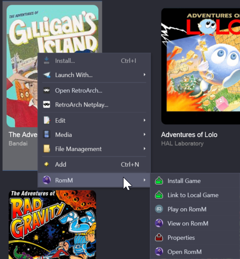

# Per Game Menu Options
This helps you control actions on a per-game basis in the library view, rather than generally through the **Tools → RomM** menu.

## Options

In LaunchBox, these actions appear under a **RomM** submenu for games the plugin recognizes as RomM-linked. In Big Box, the same actions are exposed as individual menu items instead of a submenu.

### Install Game
This option appears as **Install RomM Version...** and will download and install the game from the RomM server following the platform's configuration.

> If the game is already installed locally, the install action is hidden and the uninstall action is shown instead.

### Uninstall RomM Version
This removes locally installed RomM-managed content for the game and clears the tracked RomM install state.

### Play on RomM
This will open a web browser to the game in RomM allowing you to play the game through the EmulatorJS functionality of RomM.

> This option only appears when the game has a valid RomM association and the platform resolves to a playable RomM endpoint.

### View on RomM
This opens a web page to the game on RomM, in case you want to pull the save file, manage the game, or just double check something.

### Refresh RomM State
This refreshes the plugin's saved RomM install-state information for the selected game.

### Properties
This will show a window that lists the properties for the game as it relates to the RomM plugin (e.g. RomM ID, Platform, Installation location, etc.)
