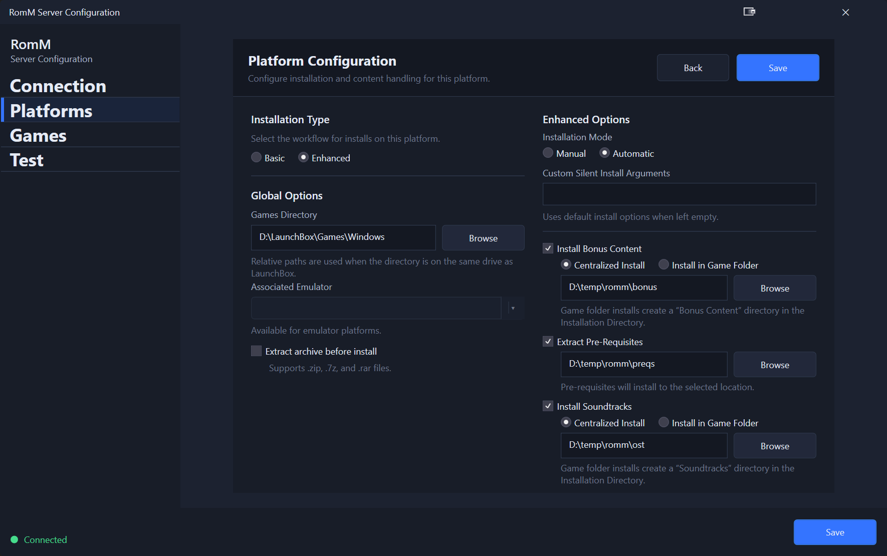

# Platform Configuration
Use this when you need to understand the platform configuration options.

## Configuration Options

### Installation Type
There are 2 types of installation - *Basic* and *Enhanced*.  A general rule of thumb is for Emulators/ROMs, you would select a *Basic* installation type, PC Games would be an *Enhanced* installation type.  Enhanced allows you to run installers and add extra logic before a game is considered to be "installed".

### Global Options
- **Games Directory**
    - Where do you want to install the games for this platform to?
    - Default: *<LaunchBox_Dir>/Games/<Platform_Name>*
- **Associated Emulator**
    - What emulator should be associated with the platform?
    - Default: Whatever emulator is set as the default for the associated platform in LaunchBox.
- **Extract archive before install**
    - Use this if you store your games in an archive on the RomM server, but the emulator does not support archives  This option will extract the contents of the archive to the Games Directory.
    - Default: *False*

### Basic Options
Use these options to configure basic platform options.

- **Self Contained**
    - This indicates whether or not the installation is a single file (e.g. *Aladdin.smc*), or if it is a more complex installation where you need to target a specific file out of many (e.g. RPCS3 needs *eboot.bin* for JB folder installs).
- **Target File(s)**
    - Comma separated list of files that you want to target (e.g. *eboot.bin*)

### Enhanced Options
Use these options when you need to handle more complex installation scenarios (e.g. Windows Games)

#### Installation Mode
This option determines whether or not you want the system to run manual installation for each install you perform.

- **Manual**
    - This will run the installers without supplying anything, essentially mimicking if you run the setup executable yourself.  This gives you the greatest level of control, but at the cost of simplicity/ease of use.
- **Automatic**
    - This will run the installers silently/intelligently, you lose granular control - but it tries to mimick the experience of installing a game from Steam, where it installs everything (Game/DLC/etc.) for you with no further interaction required.

#### Other options
These options will help you install additional enhancements that may be present in the root of the archive.  See *[Windows Games](windows-games.md) Enhancement* section for an explanation on these.

- **Install Bonus Content**
    - Specifies whether or not to install the bonus contents if any are detected in the archive.
    - **Centralized Install**: Specifies that you want to install it to a central folder (e.g. D:/Bonus Content/GAME_NAME/*)
    - **Install in Game Folder**: Specifies that you want to install it in the Games install folder (e.g. D:/temp/LaunchBox/Games/Windows/GAME NAME/Bonus/*)
- **Extract Pre-Requisites**
    - Specifies whether or not to extract the pre-reqs contents if any are detected in the archive.
- **Install Soundtracks**
    - Specifies whether or not to install the soundtracks if any are detected in the archive.
    - **Centralized Install**: Specifies that you want to install it to a central folder (e.g. D:/Soundtracks/GAME_NAME/*)
    - **Install in Game Folder**: Specifies that you want to install it in the Games install folder (e.g. D:/temp/LaunchBox/Games/Windows/GAME NAME/OST/*)