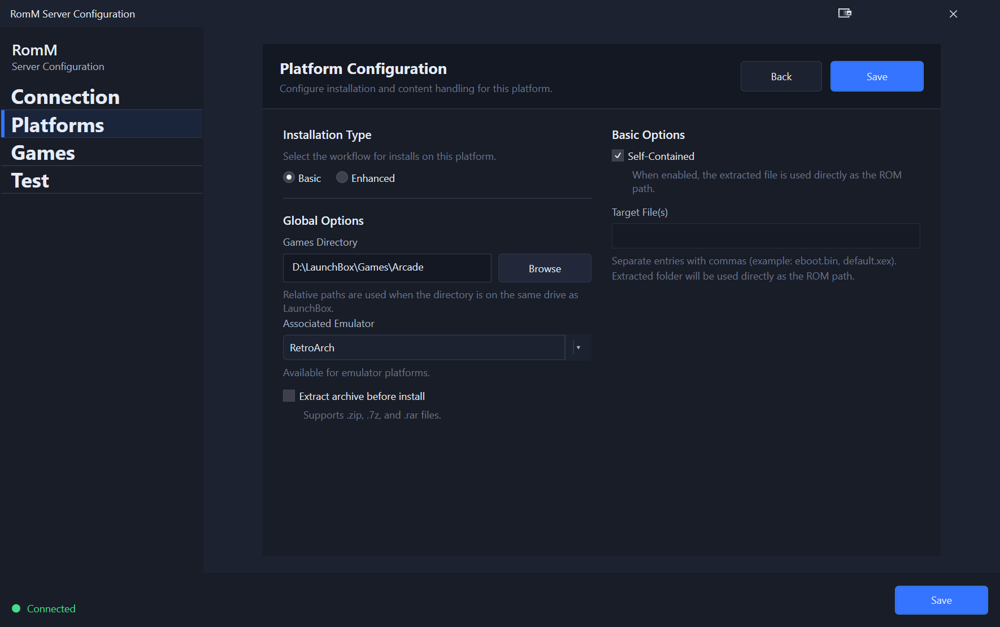
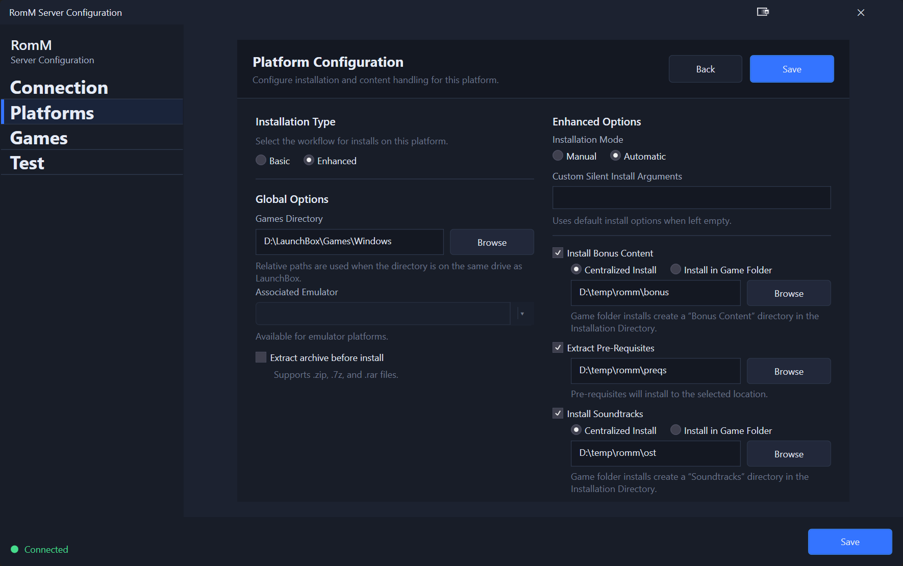

# Platform Configuration
Use this when you need to understand the platform configuration options.

## Configuration Options

The exact fields on this screen depend on the selected platform installer. Some platforms expose only a small number of settings, while others add installer-specific options.

### Installation Type
The plugin supports both simple portable installs and more advanced installer-driven workflows, but the current screen is driven by the selected platform's available options rather than a single fixed "Basic" versus "Enhanced" layout for every platform.

### Global Options
- **Games Directory**
    - Where do you want to install the games for this platform to?
    - Default: *<LaunchBox_Dir>/Games/<Platform_Name>*
- **Associated Emulator**
    - Which LaunchBox emulator mapping or override should be used when the platform needs one?
    - Default: Whatever emulator is set as the default for the associated platform in LaunchBox.
- **Extract archive before install**
    - Use this if you store your games in an archive on the RomM server and the selected platform workflow needs extracted content.
    - Default: *False*

### Basic Options
Use these options to configure basic platform options.

- **Self Contained**
    - This indicates whether or not the installation is a single file (e.g. *Aladdin.smc*), or if it is a more complex installation where you need to target a specific file out of many (e.g. RPCS3 needs *eboot.bin* for JB folder installs).
- **Target File(s)**
    - Comma separated list of files that you want to target (e.g. *eboot.bin*)

### Enhanced Options
Some platforms expose extra options for more complex installation scenarios such as Windows games, disc-based platforms, or emulator-specific overrides.

#### Installation Mode
When available, this option determines whether the system runs the install interactively or tries to automate it.

- **Manual**
    - This will run the installers without supplying anything, essentially mimicking if you run the setup executable yourself.  This gives you the greatest level of control, but at the cost of simplicity/ease of use.
- **Automatic**
    - This will run the installers silently/intelligently, you lose granular control - but it tries to mimick the experience of installing a game from Steam, where it installs everything (Game/DLC/etc.) for you with no further interaction required.

#### Other options
These options help control optional content such as bonus files, pre-requisites, or soundtracks when the selected platform installer supports them.

- **Install Bonus Content**
    - Specifies whether or not to install the bonus contents if any are detected in the archive.
    - **Centralized Install**: Specifies that you want to install it to a central folder (e.g. D:/Bonus Content/GAME_NAME/*)
    - **Install in Game Folder**: Specifies that you want to install it in the Games install folder (e.g. D:/temp/LaunchBox/Games/Windows/GAME NAME/Bonus/*)
- **Extract Pre-Requisites**
    - Specifies whether or not to extract the pre-reqs contents if any are detected in the archive.
- **Install Soundtracks**
    - Specifies whether or not to install the soundtracks if any are detected in the archive.
    - **Centralized Install**: Specifies that you want to install it to a central folder (e.g. D:/Soundtracks/GAME_NAME/*)
    - **Install in Game Folder**: Specifies that you want to install it in the Games install folder (e.g. D:/temp/LaunchBox/Games/Windows/GAME NAME/OST/*)
