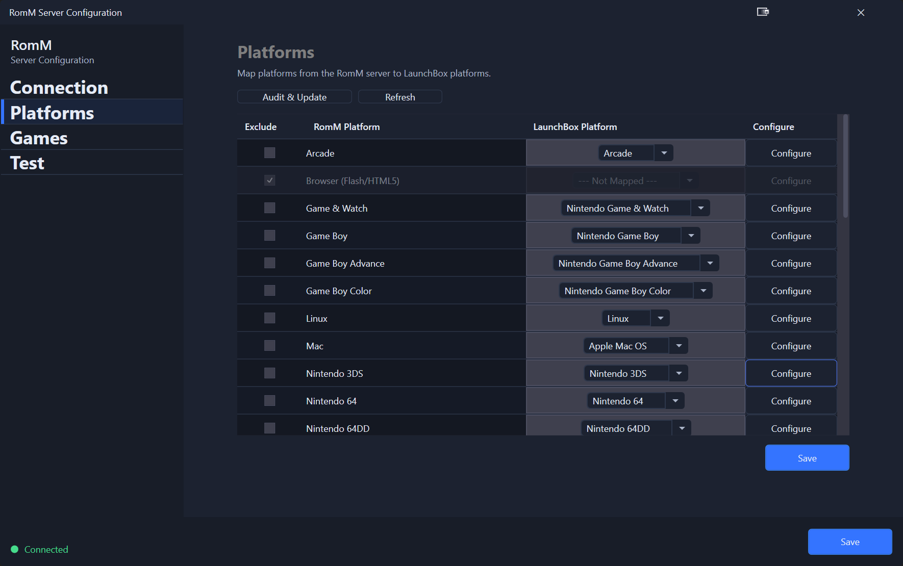

# Platform Tab
Use this tab to configure the RomM → LaunchBox platform mapping as well as the platform configuration settings.

## Platform List
The platform list will display the RomM platforms that were detected along with the LaunchBox platform.  The system will attempt to automatically map common platforms. or you can manually select the correct LaunchBox platform using the drop down.

Only mappings with a LaunchBox platform name and **Disable Auto Import** turned off are offered in the Games tab import platform selector.

### Exclude
Should you want to exclude a platform from mapping and import workflows, select the **Exclude** checkbox for that row.

### Configure
This opens the platform-specific configuration screen. The available settings depend on the installer for that platform. Common settings include install directory, extraction behavior, emulator association, and installer-specific overrides.

### Audit & Update
This audits already imported LaunchBox games for the selected mapped platform and compares them against RomM matches. It is used to repair or refresh RomM linkage and related metadata for games already in your library.

### Refresh
This will refresh the list of platforms from the RomM server.
