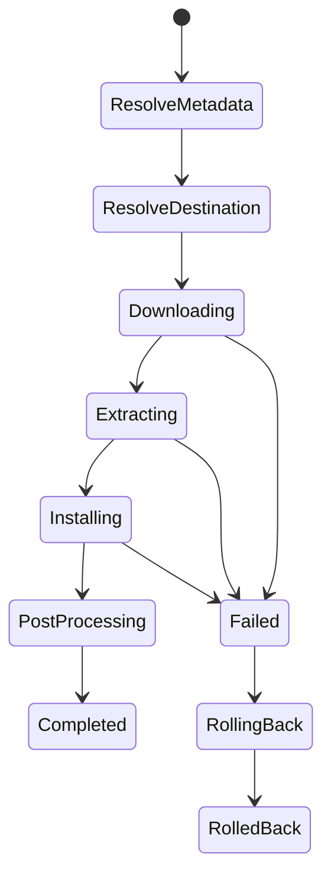

# RomMbox Windows Install Reliability Analysis

## Scope
Analysis based on [`log.log`](../log.log:6880) after plugin log merge and code review of install pipeline and state handling. Primary failure case: Tomb Raider (2013) Windows install, elevated Inno Setup batch failure (ExitCode=-1073740771).

## Phase 1: Log Analysis

### 1.1 Errors, Warnings, Exceptions (with frequency)
| Category | Signature | Count | Evidence |
|---|---|---:|---|
| Installer batch failure | Elevated installer batch failed ExitCode=-1073740771 | 3 errors + 2 warnings + 1 info result | [`log.log`](../log.log:6909)–[`log.log`](../log.log:6946) |
| MD5 skipped due to invalid ApplicationPath | Path null or steam URI | 2 warnings | [`log.log`](../log.log:2772), [`log.log`](../log.log:6836) |
| Missing emulator mapping | No emulator ID resolved for Windows | 1 warning | [`log.log`](../log.log:2772) |

### 1.2 Timing and Concurrency Signals
| Event | Timestamp | Observations |
|---|---|---|
| Download duration | 21:54:44 → 21:56:29 | ~105s for archive download; consistent flow to install start. [`log.log`](../log.log:6879)–[`log.log`](../log.log:6884) |
| Extraction duration | 21:56:29 → 21:58:35 | ~126s 7-Zip extraction. [`log.log`](../log.log:6887)–[`log.log`](../log.log:6889) |
| Installer batch duration | 21:58:35 → 22:10:12 | ~697s until exit code. [`log.log`](../log.log:6898)–[`log.log`](../log.log:6909) |

Concurrency notes: logs show a single pipeline OpId for the install (`467748e580e0471781c9bea66ff8119b`), no overlapping installs. No explicit timeouts are logged. Failure indicates a hard crash or unhandled exception in elevated installer process (ExitCode -1073740771 / 0xC000041D).

### 1.3 Failure Categorization + Frequency Table
| Failure Type | Count | Phase | Impact |
|---|---:|---|---|
| Elevated installer batch crash | 1 install | Installing | Install aborted, temp retained for troubleshooting. [`log.log`](../log.log:6911) |
| MD5 skip due to invalid ApplicationPath | 2 | ResolvingMetadata / PostProcess | Integrity not verified; identity may be incomplete. [`log.log`](../log.log:2775), [`log.log`](../log.log:6836) |
| Missing emulator mapping | 1 | PostProcess | Emulator association absent. [`log.log`](../log.log:2772) |

## Phase 2: Installation Workflow Analysis

### 2.1 Phase Mapping
| Log / Code Signal | Phase | Code Reference |
|---|---|---|
| DownloadStarted/Completed | Downloading | [`InstallCoordinator.RunAsync()`](../src/RomM.LaunchBoxPlugin/Services/Install/Pipeline/InstallCoordinator.cs:26), [`DownloadStep.ExecuteAsync()`](../src/RomM.LaunchBoxPlugin/Services/Install/Pipeline/Steps/DownloadStep.cs:20) |
| Extraction, install classification | Extracting / Installing | [`WindowsInstallSubsystem.InstallAsync()`](../src/RomM.LaunchBoxPlugin/Services/Install/WindowsInstallSubsystem.cs:49) |
| PersistState | Installing / PostProcessing | [`PersistStateStep.ExecuteAsync()`](../src/RomM.LaunchBoxPlugin/Services/Install/Pipeline/Steps/PersistStateStep.cs:12) |
| PostProcess (emulator, path) | PostProcessing | [`PostProcessStep.ExecuteAsync()`](../src/RomM.LaunchBoxPlugin/Services/Install/Pipeline/Steps/PostProcessStep.cs:12) |

### 2.2 State Management Review
Install state is tracked in SQLite via [`InstallStateService`](../src/RomM.LaunchBoxPlugin/Services/InstallStateService.cs:48). The pipeline uses an `InstallContext` snapshot model [`InstallStateSnapshot`](../src/RomM.LaunchBoxPlugin/Services/Install/Pipeline/InstallStateSnapshot.cs:6) and persists state after steps. There is no explicit transactional boundary across download, extract, install, and post-process; cleanup is best-effort (temp root is deleted in finally, except when failures are logged and temp retained). [`InstallCoordinator.RunAsync()`](../src/RomM.LaunchBoxPlugin/Services/Install/Pipeline/InstallCoordinator.cs:26)

Observations:
- Install failures do not show explicit rollback of partial installs; `ConfirmInstallerSuccess` is used but post-crash conditions are not reconciled. [`WindowsInstallSubsystem.ConfirmInstallerSuccess()`](../src/RomM.LaunchBoxPlugin/Services/Install/WindowsInstallSubsystem.cs:1114)
- Failure logs report leaving temp install root, but no state update indicates an error state with recovery hints. [`log.log`](../log.log:6911)

## Phase 3: Reliability Gaps

1. **Elevated installer batch failure lacks diagnostics**
   - Only exit code is captured; no stdout/stderr or installer log surfaced. [`log.log`](../log.log:6909)
2. **Non-transactional install**
   - Partial installs may remain if installer partially wrote to target but failed mid-flight; no rollback or staging directory swap. [`WindowsInstallSubsystem.InstallAsync()`](../src/RomM.LaunchBoxPlugin/Services/Install/WindowsInstallSubsystem.cs:49)
3. **MD5 integrity validation skipped for steam URIs**
   - Integrity check requires valid local path; path resolution fails for steam protocol. [`log.log`](../log.log:6836)
4. **Weak observability in failure path**
   - Install pipeline failure logs are high-level; root cause (crash reason) absent. [`log.log`](../log.log:6911)

## Phase 4: Prioritized Recommendations

### P0: Crash resilience for elevated installers
- Capture installer output and create a structured failure artifact (installer log file path + last N lines). Pass Inno Setup `/LOG=` option when possible. Tie into [`ProcessRunner.RunElevatedBatchAsync()`](../src/RomM.LaunchBoxPlugin/Services/Install/WindowsInstallSubsystem.cs:1451).
- Detect specific NTSTATUS codes (0xC000041D) and surface actionable hints in UI and logs.

### P1: Transactional install model
- Install into a staging directory, verify executable + manifest, then atomically move to final install dir. If failure, clean staging. Wire into [`InstallContentStep.ExecuteAsync()`](../src/RomM.LaunchBoxPlugin/Services/Install/Pipeline/Steps/InstallContentStep.cs:22).

### P1: State machine + retry policy
- Persist `InstallPhase` + `InstallState` transitions with status (`Pending`, `InProgress`, `Failed`, `RolledBack`). Update in [`InstallStateService.UpsertStateAsync()`](../src/RomM.LaunchBoxPlugin/Services/InstallStateService.cs:451).

### P2: Integrity checks for non-file URIs
- When ApplicationPath is a protocol URI, attempt to resolve actual install paths or skip MD5 with explicit reason in UI. [`log.log`](../log.log:6836)

### P2: Observability improvements
- Add structured metrics (phase duration, extraction size, installer exit code category). Use `OpId` correlation already present.

## Phase 5: Transactional Install Model Proposal

### State Machine


### Rollback and Atomicity Rules
1. Use `InstallDir\.staging\{OpId}` for all writes.
2. On success: validate executable and required files, then move staging to final dir with atomic rename.
3. On failure: delete staging and restore previous install if present (move back from `.previous`).

### Pseudocode
```csharp
// See InstallCoordinator.RunAsync and WindowsInstallSubsystem.InstallAsync
Install(request):
  snapshot = CreateSnapshot()
  Persist(snapshot, phase=ResolveMetadata, status=InProgress)
  ResolveMetadata()
  Persist(snapshot, phase=ResolveDestination, status=InProgress)
  ResolveDestination()
  Persist(snapshot, phase=Downloading, status=InProgress)
  Download()
  Persist(snapshot, phase=Extracting, status=InProgress)
  Extract()
  Persist(snapshot, phase=Installing, status=InProgress)
  staging = CreateStagingDir()
  InstallInto(staging)
  Verify(staging)
  SwapStagingToFinal(staging)
  Persist(snapshot, phase=PostProcessing, status=InProgress)
  PostProcess()
  Persist(snapshot, phase=Completed, status=Success)
catch ex:
  Persist(snapshot, phase=Failed, status=Failed, error=ex)
  Rollback(staging, previous)
  Persist(snapshot, phase=RolledBack, status=Failed)
  throw
```

## Phase 6: Risk / Impact Matrix

| Risk | Likelihood | Impact | Mitigation |
|---|---|---|---|
| Elevated installer crash | Medium | High | Capture installer logs, add retry or fallback to non-elevated mode, detect NTSTATUS. [`log.log`](../log.log:6909) |
| Partial install residue | Medium | Medium | Transactional staging + atomic swap, rollback on failure. [`WindowsInstallSubsystem.InstallAsync()`](../src/RomM.LaunchBoxPlugin/Services/Install/WindowsInstallSubsystem.cs:49) |
| Integrity not verified for protocol paths | High | Low | Resolve protocol to local path or mark unverifiable with UI warning. [`log.log`](../log.log:6836) |
| State ambiguity after failure | Medium | Medium | Persist explicit failed state + recovery instructions in InstallState. [`InstallStateService.UpsertStateAsync()`](../src/RomM.LaunchBoxPlugin/Services/InstallStateService.cs:451) |

## Appendix: Key Evidence Excerpts
- Installer batch failure and exception: [`log.log`](../log.log:6909)–[`log.log`](../log.log:6934)
- Download/extract/install timings: [`log.log`](../log.log:6879)–[`log.log`](../log.log:6889)
- MD5 skip for invalid ApplicationPath: [`log.log`](../log.log:6836)

